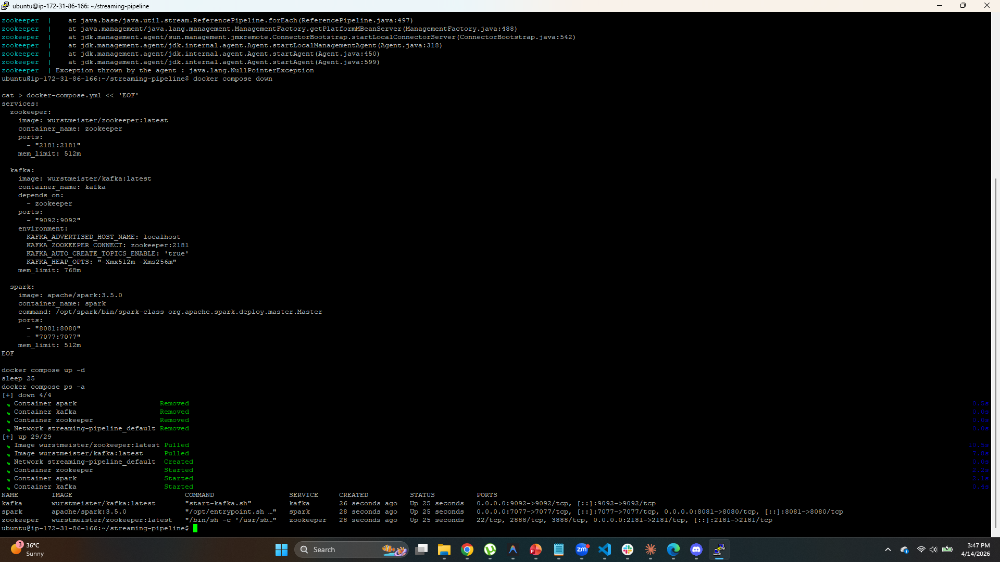
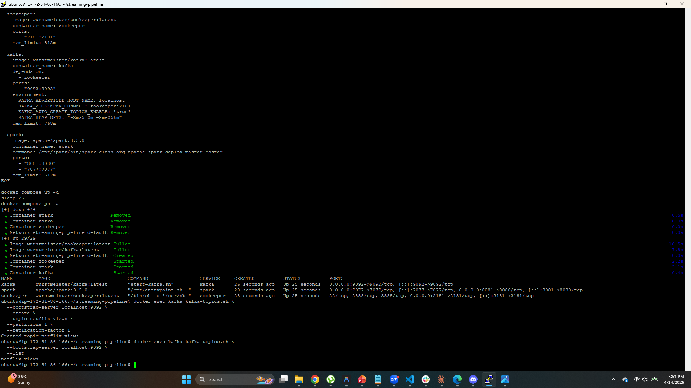
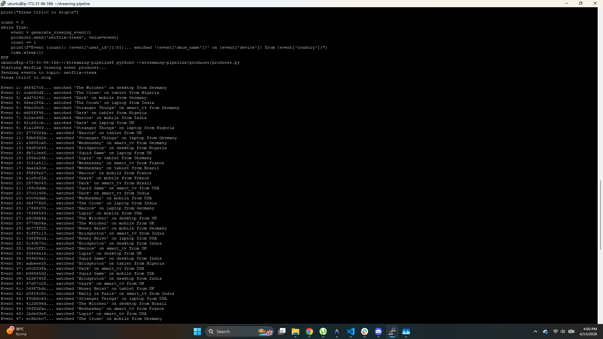
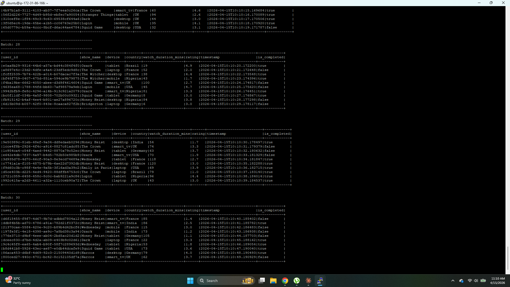
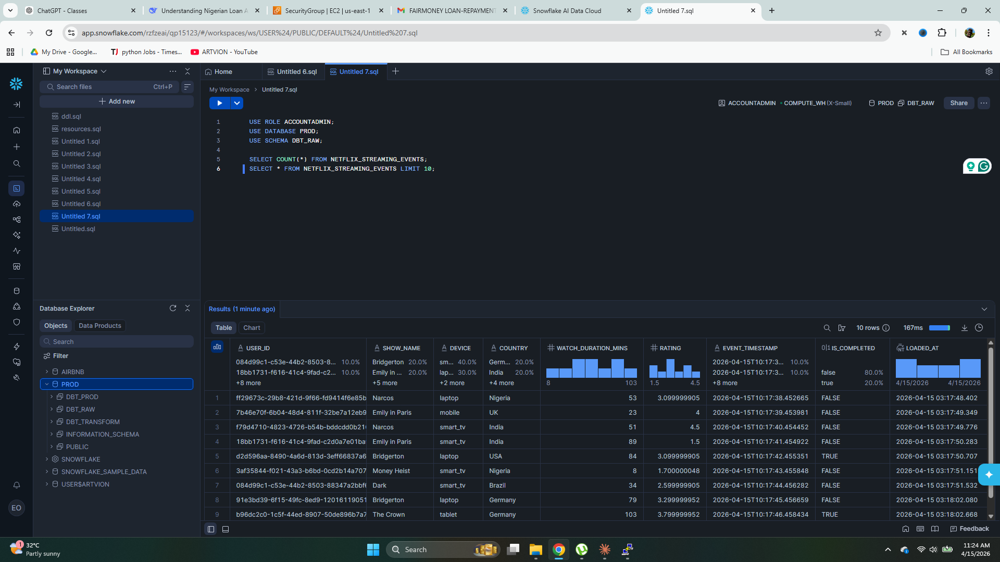

# 🎬 Real-Time Netflix Streaming Pipeline

> A production-grade real-time data streaming pipeline that processes live Netflix viewing events using Apache Kafka, Apache Spark (PySpark), Snowflake and Docker — all running on AWS EC2.

---

## 📌 Table of Contents

- [Project Overview](#-project-overview)
- [Architecture](#-architecture)
- [Tech Stack](#-tech-stack)
- [Project Structure](#-project-structure)
- [How It Works](#-how-it-works)
- [Setup Guide](#-setup-guide)
- [Running the Pipeline](#-running-the-pipeline)
- [Setbacks & Lessons Learned](#-setbacks--lessons-learned)
- [Screenshots](#-screenshots)
- [Author](#-author)

---

## 📖 Project Overview

This project builds a **real-time streaming pipeline** that:

1. **Produces** simulated Netflix viewing events (users watching shows, ratings, devices, countries) every second using Python
2. **Streams** events through Apache Kafka into a topic called `netflix-views`
3. **Processes** the stream in real-time using Apache Spark Structured Streaming
4. **Loads** processed events into Snowflake every 15 seconds automatically

The key difference from a batch pipeline (like Project 1) is that data flows **continuously** — there is no waiting for files to arrive. Events are processed the moment they happen.

**Real-world equivalent:** This is exactly how Netflix tracks what you are watching in real-time, how Uber tracks driver locations, and how banks detect fraud as transactions happen.

---

## 🏗️ Architecture

```
┌─────────────────────────────────────────────────────────────┐
│                    AWS EC2 (Ubuntu 24.04)                   │
│                                                             │
│  ┌─────────────┐    ┌──────────────┐    ┌───────────────┐  │
│  │   Python    │    │    Docker    │    │    PySpark    │  │
│  │  Producer   │───▶│    Kafka     │───▶│   Consumer   │  │
│  │             │    │  + Zookeeper │    │               │  │
│  │ Fake Netflix│    │              │    │ Reads every   │  │
│  │ events every│    │ netflix-views│    │ 15 seconds    │  │
│  │ 1 second    │    │    topic     │    │               │  │
│  └─────────────┘    └──────────────┘    └───────┬───────┘  │
│                                                 │           │
│                                                 ▼           │
│                                        ┌───────────────┐   │
│                                        │   Snowflake   │   │
│                                        │  PROD.DBT_RAW │   │
│                                        │  NETFLIX_     │   │
│                                        │  STREAMING_   │   │
│                                        │  EVENTS       │   │
│                                        └───────────────┘   │
└─────────────────────────────────────────────────────────────┘
```

---

## 🛠️ Tech Stack

| Technology | Purpose | Version |
|------------|---------|---------|
| **Apache Kafka** | Real-time message streaming | 7.3.0 (Confluent) |
| **Apache Zookeeper** | Kafka cluster coordination | 7.3.0 (Confluent) |
| **Apache Spark (PySpark)** | Stream processing | 3.5.1 |
| **Snowflake** | Cloud data warehouse (sink) | Standard Edition |
| **Docker + Docker Compose** | Container orchestration | 29.4.0 |
| **Python** | Producer + consumer scripts | 3.12 |
| **AWS EC2** | Cloud server | Ubuntu 24.04 |
| **AWS SSM** | Secure credential storage | - |
| **Faker library** | Realistic fake data generation | - |

---

## 📁 Project Structure

```
netflix-streaming-pipeline/
├── docker-compose.yml          ← Kafka + Zookeeper + Spark containers
├── .gitignore
│
├── producer/
│   └── producer.py             ← Generates fake Netflix viewing events
│
├── consumer/
│   ├── spark_consumer.py       ← Reads from Kafka, displays to console
│   └── spark_snowflake_consumer.py  ← Reads from Kafka, writes to Snowflake
│
└── snowflake/
    └── sink.py                 ← Snowflake connection and write logic
```

---

## 🔄 How It Works

### Step 1 — The Producer
The Python producer generates realistic fake Netflix viewing events using the `Faker` library. Every second it creates a new event containing:
- A random user ID
- A random Netflix show (Stranger Things, Dark, Squid Game etc.)
- The device used (mobile, smart_tv, laptop etc.)
- The country the user is watching from
- Watch duration in minutes
- A rating between 1.0 and 5.0
- A timestamp
- Whether the show was completed

Each event is serialized as JSON and sent to the Kafka topic `netflix-views`.

### Step 2 — Kafka
Kafka acts as the message broker. It receives every event from the producer and stores it in the `netflix-views` topic. Kafka holds the messages safely until the consumer is ready to read them. Even if the consumer is temporarily down, no messages are lost.

Zookeeper runs alongside Kafka to manage the cluster — it keeps track of which brokers are alive and manages topic configurations.

### Step 3 — Spark Structured Streaming
PySpark connects to Kafka and reads messages in micro-batches every 15 seconds. For each batch it:
- Reads the raw JSON messages from Kafka
- Parses them into a structured DataFrame with typed columns
- Passes each batch to the Snowflake writer function

### Step 4 — Snowflake
The Snowflake sink function receives each processed batch and inserts the rows into the `NETFLIX_STREAMING_EVENTS` table in the `PROD.DBT_RAW` schema. Snowflake credentials are fetched securely from AWS SSM Parameter Store — never hardcoded.

---

## 🚀 Setup Guide

### Prerequisites
- AWS EC2 instance (Ubuntu 24.04, minimum 4GB RAM recommended)
- Snowflake account
- AWS SSM Parameter Store with these parameters:
  - `/snowflake/username`
  - `/snowflake/password`
  - `/snowflake/accountname`
- Docker and Docker Compose installed
- Python 3.12 with pip
- Java (OpenJDK) installed

### Step 1 — Install Java
```bash
sudo apt-get install -y default-jdk
echo 'export JAVA_HOME=/usr/lib/jvm/default-java' >> ~/.bashrc
source ~/.bashrc
java -version
```

### Step 2 — Install Python dependencies
```bash
pip install kafka-python faker pyspark==3.5.1 snowflake-connector-python --break-system-packages
```

### Step 3 — Start the Docker containers
```bash
cd ~/netflix-streaming-pipeline
docker compose up -d
docker compose ps
```

You should see:
```
kafka       Up   port 9092
spark       Up   ports 7077, 8081
zookeeper   Up   port 2181
```

### Step 4 — Create the Kafka topic
```bash
docker exec kafka kafka-topics.sh \
  --bootstrap-server localhost:9092 \
  --create \
  --topic netflix-views \
  --partitions 1 \
  --replication-factor 1
```

### Step 5 — Create the Snowflake table
The table is created automatically when the pipeline first runs. But you can also create it manually:
```sql
CREATE TABLE IF NOT EXISTS PROD.DBT_RAW.NETFLIX_STREAMING_EVENTS (
    USER_ID VARCHAR,
    SHOW_NAME VARCHAR,
    DEVICE VARCHAR,
    COUNTRY VARCHAR,
    WATCH_DURATION_MINS INTEGER,
    RATING FLOAT,
    EVENT_TIMESTAMP VARCHAR,
    IS_COMPLETED BOOLEAN,
    LOADED_AT TIMESTAMP DEFAULT CURRENT_TIMESTAMP
);
```

---

## ▶️ Running the Pipeline

You need **two terminal windows** open simultaneously.

### Terminal 1 — Start the Producer
```bash
python3 producer/producer.py
```

You will see events streaming every second:
```
Event 1: abc12345... watched 'Squid Game' on mobile from Nigeria
Event 2: def67890... watched 'Dark' on smart_tv from USA
Event 3: ghi11111... watched 'Wednesday' on laptop from UK
```

### Terminal 2 — Start the Spark → Snowflake Consumer
```bash
python3 consumer/spark_snowflake_consumer.py
```

You will see batches being written to Snowflake every 15 seconds:
```
Starting Spark Streaming → Snowflake pipeline...
Reading from Kafka topic: netflix-views
Writing to Snowflake: PROD.DBT_RAW.NETFLIX_STREAMING_EVENTS

Batch 0: No data to write
Table ready!
Batch 1: Inserted 7 rows into Snowflake!
Batch 2: Inserted 15 rows into Snowflake!
```

### Verify data in Snowflake
```sql
USE ROLE ACCOUNTADMIN;
USE DATABASE PROD;
USE SCHEMA DBT_RAW;

SELECT COUNT(*) FROM NETFLIX_STREAMING_EVENTS;
SELECT * FROM NETFLIX_STREAMING_EVENTS LIMIT 10;
```

### Stop the pipeline
Press **Ctrl+C** in both terminals, then:
```bash
docker compose down
```

---

## ⚠️ Setbacks & Lessons Learned

This project was built as a learning exercise on a small EC2 instance. Here are the real errors encountered and how they were resolved:

### 1. Zookeeper crashing with NullPointerException
**Error:** `Exception thrown by the agent: java.lang.NullPointerException`
**Cause:** `confluentinc/cp-zookeeper:7.3.0` is incompatible with Ubuntu 24.04's newer Linux kernel
**Fix:** Switched to `wurstmeister/zookeeper:latest` which handles newer kernels correctly
**Lesson:** Always check Docker image compatibility with your OS version

### 2. Kafka cannot resolve Zookeeper hostname
**Error:** `Unable to canonicalize address zookeeper:2181 because it's not resolvable`
**Fix:** Added explicit `hostname` and `container_name` fields to docker-compose and configured dual listeners:
```yaml
KAFKA_ADVERTISED_LISTENERS: PLAINTEXT://kafka:29092,PLAINTEXT_HOST://localhost:9092
KAFKA_LISTENER_SECURITY_PROTOCOL_MAP: PLAINTEXT:PLAINTEXT,PLAINTEXT_HOST:PLAINTEXT
```
**Lesson:** Docker containers need explicit hostnames for inter-container communication

### 3. PySpark version conflict with Kafka connector
**Error:** `java.lang.NoSuchMethodError: scala.collection.mutable.WrappedArray`
**Cause:** PySpark 4.1.1 uses Scala 2.13 but the Kafka connector jar was built for Scala 2.12
**Fix:** Downgraded PySpark to 3.5.1 which uses Scala 2.12 matching the connector
**Lesson:** Always match PySpark version with Kafka connector Scala version

### 4. Java not installed
**Error:** `JAVA_HOME is not set` / `Java gateway process exited`
**Fix:** Installed OpenJDK and set JAVA_HOME:
```bash
sudo apt-get install -y default-jdk
echo 'export JAVA_HOME=/usr/lib/jvm/default-java' >> ~/.bashrc
source ~/.bashrc
```
**Lesson:** PySpark requires Java — always install it before running Spark locally

### 5. Snowflake insufficient privileges
**Error:** `SQL access control error: Insufficient privileges to operate on table`
**Fix:**
```sql
GRANT ALL PRIVILEGES ON ALL TABLES IN SCHEMA PROD.DBT_RAW TO ROLE ACCOUNTADMIN;
GRANT ALL PRIVILEGES ON FUTURE TABLES IN SCHEMA PROD.DBT_RAW TO ROLE ACCOUNTADMIN;
```
**Lesson:** Snowflake's ACCOUNTADMIN role still needs explicit grants on objects created by other roles

### 6. Memory constraints on small EC2
**Challenge:** Kafka, Zookeeper and Spark together need 6-8GB RAM but the EC2 only has 3.7GB
**Fix:** Set strict memory limits in docker-compose:
```yaml
mem_limit: 256m  # Zookeeper
mem_limit: 512m  # Kafka
mem_limit: 512m  # Spark
```
And configured Spark driver/executor memory:
```python
.config("spark.driver.memory", "512m")
.config("spark.executor.memory", "512m")
```
**Lesson:** Always profile your memory requirements before choosing an instance type

---

## 📸 Screenshots

### Kafka + Zookeeper + Spark running in Docker


### Kafka topic created


### Producer sending live Netflix events


### Spark consuming events from Kafka


### Real-time data landing in Snowflake


---

## 🔮 Future Improvements

- Add dbt transformations on top of the streaming data in Snowflake
- Add Airflow to orchestrate and monitor the pipeline
- Add Slack alerts when the pipeline fails
- Scale Kafka to multiple partitions for higher throughput
- Add a data quality layer using Great Expectations
- Build a real-time dashboard on top of Snowflake using Streamlit

---

## 📊 Comparison: Batch vs Streaming

| Feature | Project 1 (Batch) | Project 2 (Streaming) |
|---------|-------------------|----------------------|
| Data frequency | Once per day | Every second |
| Latency | Hours | Seconds |
| Tools | Airflow + dbt | Kafka + Spark |
| Use case | Daily analytics | Real-time monitoring |
| Complexity | Medium | High |

Both approaches are used in production — batch for historical analysis, streaming for real-time decisions.

---

## 👤 Author

**Ekemini Ime Otu**
- GitHub: [@EkeminiImeOtu](https://github.com/EkeminiImeOtu)
- Project 1: [Netflix ETL Pipeline](https://github.com/EkeminiImeOtu/netflix-etl-pipeline)

---

*This project was built as part of a data engineering learning journey, covering real-time streaming with Kafka, Spark and Snowflake on AWS.*
